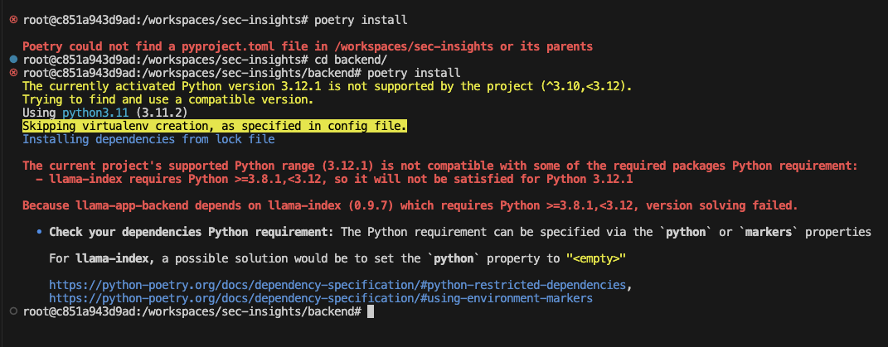

# Resources

## Bundling Poetry

[Packaging a Poetry Project in a Docker Container](https://dev.to/farcellier/package-a-poetry-project-in-a-docker-container-for-production-3b4m)

[Document Docker Poetry Best Practices](https://github.com/orgs/python-poetry/discussions/1879)

## Python Version 3.12.1

